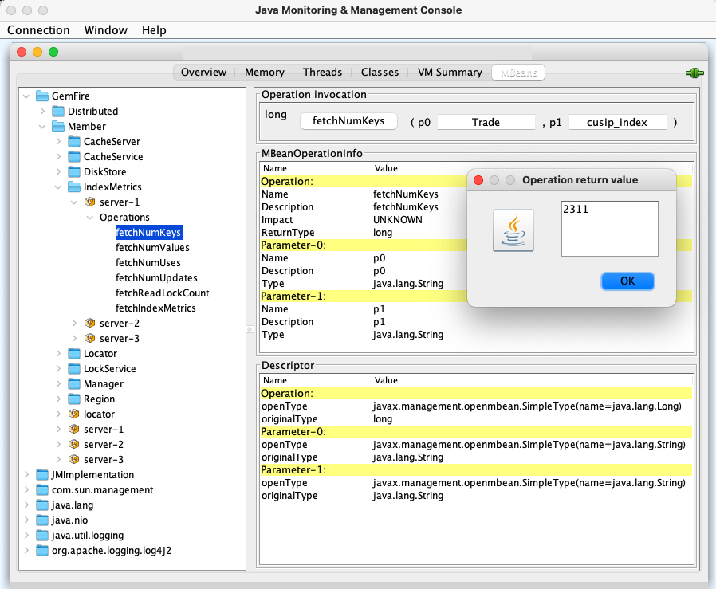
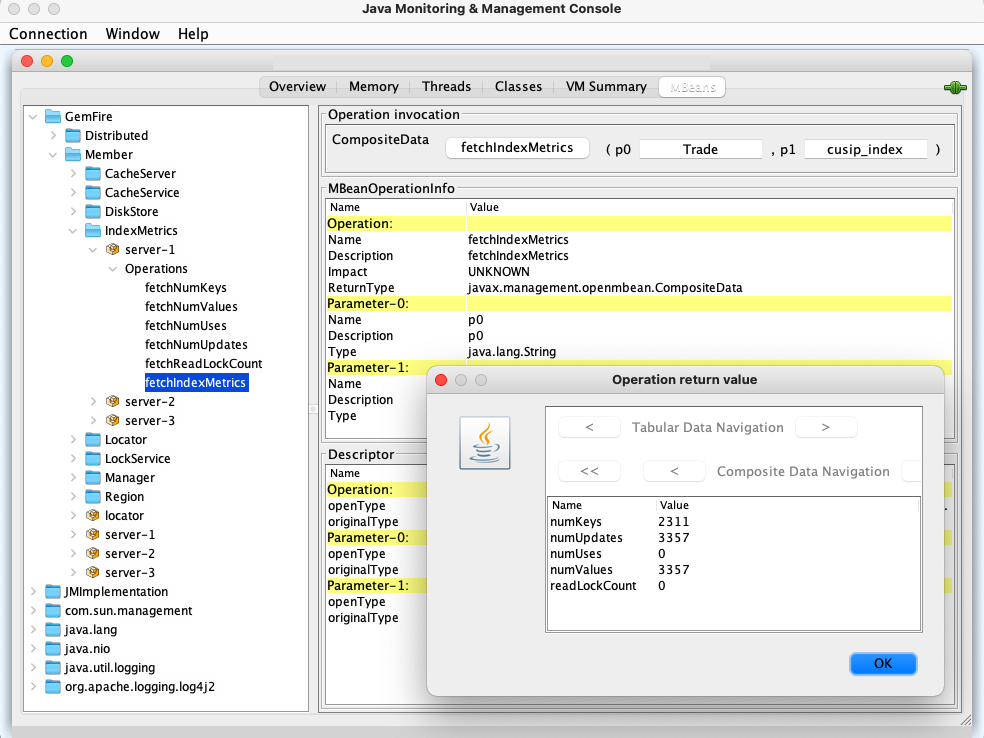

# Create Custom JMX MBean
## Description

This example provides a custom JMX MBean implementation and registration.

The **IndexMetricsMXBean** is the MBean interface. It provides these operations  for a specific Region and Index name:

- fetchNumKeys - gets the number of keys
- fetchNumValues - gets the number of values
- fetchNumUses - gets the number of uses
- fetchNumUpdates - gets the number of updates
- fetchReadLockCount - gets the number of read locks
- fetchIndexMetrics - gets all of these values in one **IndexMetrics** object

The **IndexMetricsMBean** provides the implementation of **IndexMetricsMXBean**.

The **IndexMetrics** is a data object that wraps all of the relevant metrics for an Index.

The **IndexMetricsMXBeanInitializer** is a CacheListener that creates and registers the IndexMetricsMBean in its *initialize* method.

## Initialization
Modify the **GEODE** environment variable in the *setenv.sh* script to point to a Geode installation directory.
## Build
Build the Spring Boot Client Application and Geode Server MBean classes using gradle like:

```
./gradlew clean jar bootJar
```
## Run Example
### Start and Configure Locator and Servers
Start and configure the locator and servers using the *startandconfigure.sh* script like:

```
./startandconfigure.sh
```
Note:

The MBean classes have to be on the locator classpath.

### Load Entries
Load N Trade instances into the Trade region using the *runclient.sh* script like below.

The parameters are:

- operation (load)
- number of entries (e.g. 5000)

```
./runclient.sh load 5000
```
### Start JConsole
Start JConsole using the *startjconsole.sh* script like:

```
./startjconsole.sh
```
### Execute JMX Operation
Once JConsole starts:

- select 'Insecure connection' to connect to the JMX manager (locator)
- select the MBeans tab
- navigate to the **MetricsIndexMXBean**  by selecting GemFire -> Member -> Index Metrics -> desired server (e.g. server-1) -> Operations
- input the parameters for the desired operation -  region name for p0 (e.g. Trade) and the index name for p1 (e.g. cusip_index)
- execute the operation by selecting the operation name

### Shutdown Locator and Servers
Execute the *shutdownall.sh* script to shutdown the servers and locator like:

```
./shutdownall.sh
```
### Remove Locator and Server Files
Execute the *cleanupfiles.sh* script to remove the server and locator files like:

```
./cleanupfiles.sh
```
## Example Output
### Start and Configure Locator and Servers
Sample output from the *startandconfigure.sh* script is:

```
./startandconfigure.sh
1. Executing - start locator --name=locator --classpath=../server/build/libs/server-0.0.1-SNAPSHOT.jar

..................
Locator in <working-dir>/locator on 192.168.1.6[10334] as locator is currently online.
Process ID: 12915
Uptime: 26 seconds
Geode Version: 1.15.0-build.0
Java Version: 1.8.0_151
Log File: <working-dir>/locator/locator.log
JVM Arguments: <jvm-arguments>
Class-Path: <classpath>

Successfully connected to: JMX Manager [host=192.168.1.6, port=1099]

Cluster configuration service is up and running.

2. Executing - set variable --name=APP_RESULT_VIEWER --value=any

Value for variable APP_RESULT_VIEWER is now: any.

3. Executing - configure pdx --read-serialized=true --auto-serializable-classes=.*

read-serialized = true
ignore-unread-fields = false
persistent = false
PDX Serializer = org.apache.geode.pdx.ReflectionBasedAutoSerializer
Non Portable Classes = [.*]
Cluster configuration for group 'cluster' is updated.

4. Executing - start server --name=server-1 --server-port=0 --statistic-archive-file=cacheserver.gfs --J=-Dgemfire.log-file=cacheserver.log --J=-Dgemfire.conserve-sockets=false

.....
Server in <working-dir>/server-1 on 192.168.1.6[50831] as server-1 is currently online.
Process ID: 12961
Uptime: 5 seconds
Geode Version: 1.15.0-build.0
Java Version: 1.8.0_151
Log File: <working-dir>/server-1/cacheserver.log
JVM Arguments: <jvm-arguments>
Class-Path: <classpath>

5. Executing - start server --name=server-2 --server-port=0 --statistic-archive-file=cacheserver.gfs --J=-Dgemfire.log-file=cacheserver.log --J=-Dgemfire.conserve-sockets=false

....
Server in <working-dir>/server-2 on 192.168.1.6[50861] as server-2 is currently online.
Process ID: 12976
Uptime: 4 seconds
Geode Version: 1.15.0-build.0
Java Version: 1.8.0_151
Log File: <working-dir>/server-2/cacheserver.log
JVM Arguments: <jvm-arguments>
Class-Path: <classpath>

6. Executing - start server --name=server-3 --server-port=0 --statistic-archive-file=cacheserver.gfs --J=-Dgemfire.log-file=cacheserver.log --J=-Dgemfire.conserve-sockets=false

.....
Server in <working-dir>/server-3 on 192.168.1.6[50896] as server-3 is currently online.
Process ID: 12977
Uptime: 6 seconds
Geode Version: 1.15.0-build.0
Java Version: 1.8.0_151
Log File: <working-dir>/server-3/cacheserver.log
JVM Arguments: <jvm-arguments>
Class-Path: <classpath>

7. Executing - deploy --jar=server/build/libs/server-0.0.1-SNAPSHOT.jar

 Member  |            JAR            | JAR Location
-------- | ------------------------- | ---------------------------------------------------
server-1 | server-0.0.1-SNAPSHOT.jar | <working-dir>/server-1/server-0.0.1-SNAPSHOT.v1.jar
server-2 | server-0.0.1-SNAPSHOT.jar | <working-dir>/server-2/server-0.0.1-SNAPSHOT.v1.jar
server-3 | server-0.0.1-SNAPSHOT.jar | <working-dir>/server-3/server-0.0.1-SNAPSHOT.v1.jar

8. Executing - create region --name=Trade --type=PARTITION_REDUNDANT --cache-listener=example.server.callback.IndexMetricsMXBeanInitializer

 Member  | Status | Message
-------- | ------ | -------------------------------------
server-1 | OK     | Region "/Trade" created on "server-1"
server-2 | OK     | Region "/Trade" created on "server-2"
server-3 | OK     | Region "/Trade" created on "server-3"

Cluster configuration for group 'cluster' is updated.

9. Executing - create index --name=cusip_index  --expression=cusip --region=/Trade


               Member                 | Status | Message
------------------------------------- | ------ | --------------------------
192.168.1.6(server-1:12961)<v1>:41001 | OK     | Index successfully created
192.168.1.6(server-2:12976)<v2>:41002 | OK     | Index successfully created
192.168.1.6(server-3:12977)<v3>:41003 | OK     | Index successfully created

Cluster configuration for group 'cluster' is updated.

10. Executing - list members

Member Count : 4

  Name   | Id
-------- | --------------------------------------------------------------
locator  | 192.168.1.6(locator:12915:locator)<ec><v0>:41000 [Coordinator]
server-1 | 192.168.1.6(server-1:12961)<v1>:41001
server-2 | 192.168.1.6(server-2:12976)<v2>:41002
server-3 | 192.168.1.6(server-3:12977)<v3>:41003

11. Executing - list functions

 Member  | Function
-------- | -----------------------------
server-1 | GetIndexReadLockCountFunction
server-2 | GetIndexReadLockCountFunction
server-3 | GetIndexReadLockCountFunction

12. Executing - list regions

List of regions
---------------
Trade

13. Executing - list indexes

Member Name |               Member ID               | Region Path |    Name     | Type  | Indexed Expression | From Clause | Valid Index
----------- | ------------------------------------- | ----------- | ----------- | ----- | ------------------ | ----------- | -----------
server-1    | 192.168.1.6(server-1:12961)<v1>:41001 | /Trade      | cusip_index | RANGE | cusip              | /Trade      | true
server-2    | 192.168.1.6(server-2:12976)<v2>:41002 | /Trade      | cusip_index | RANGE | cusip              | /Trade      | true
server-3    | 192.168.1.6(server-3:12977)<v3>:41003 | /Trade      | cusip_index | RANGE | cusip              | /Trade      | true

************************* Execution Summary ***********************
Script file: startandconfigure.gfsh

Command-1 : start locator --name=locator --classpath=../server/build/libs/server-0.0.1-SNAPSHOT.jar
Status    : PASSED

Command-2 : set variable --name=APP_RESULT_VIEWER --value=any
Status    : PASSED

Command-3 : configure pdx --read-serialized=true --auto-serializable-classes=.*
Status    : PASSED

Command-4 : start server --name=server-1 --server-port=0 --statistic-archive-file=cacheserver.gfs --J=-Dgemfire.log-file=cacheserver.log --J=-Dgemfire.conserve-sockets=false
Status    : PASSED

Command-5 : start server --name=server-2 --server-port=0 --statistic-archive-file=cacheserver.gfs --J=-Dgemfire.log-file=cacheserver.log --J=-Dgemfire.conserve-sockets=false
Status    : PASSED

Command-6 : start server --name=server-3 --server-port=0 --statistic-archive-file=cacheserver.gfs --J=-Dgemfire.log-file=cacheserver.log --J=-Dgemfire.conserve-sockets=false
Status    : PASSED

Command-7 : deploy --jar=server/build/libs/server-0.0.1-SNAPSHOT.jar
Status    : PASSED

Command-8 : create region --name=Trade --type=PARTITION_REDUNDANT --cache-listener=example.server.callback.IndexMetricsMXBeanInitializer
Status    : PASSED

Command-9 : create index --name=cusip_index  --expression=cusip --region=/Trade
Status    : PASSED

Command-10 : list members
Status     : PASSED

Command-11 : list functions
Status     : PASSED

Command-12 : list regions
Status     : PASSED

Command-13 : list indexes
Status     : PASSED
```
### Load Entries
Sample output from the *runclient.sh* script is:

```
./runclient.sh load 5000   

2021-10-10 17:48:49.049  INFO 13643 --- [           main] example.client.Client                    : Starting Client using Java 1.8.0_151 on barretts-macbook-pro with PID 13643 (/Users/boglesby/Dev/geode-examples/create-custom-mbean/client/build/classes/java/main started by boglesby in /Users/boglesby/Dev/geode-examples/create-custom-mbean/client)
...
2021-10-10 17:48:54.809  INFO 13643 --- [           main] example.client.Client                    : Started Client in 6.531 seconds (JVM running for 7.303)
2021-10-10 17:48:54.813  INFO 13643 --- [           main] example.client.service.TradeService      : Putting 5000 trades of size 16 bytes
2021-10-10 17:48:55.131  INFO 13643 --- [           main] example.client.service.TradeService      : Saved Trade(id=0, cusip=UPS, shares=54, price=150.82, createTime=1633924134813, updateTime=1633924134813)
2021-10-10 17:48:55.211  INFO 13643 --- [           main] example.client.service.TradeService      : Saved Trade(id=1, cusip=UNH, shares=53, price=359.01, createTime=1633924135132, updateTime=1633924135132)
2021-10-10 17:48:55.255  INFO 13643 --- [           main] example.client.service.TradeService      : Saved Trade(id=2, cusip=PFE, shares=51, price=57.76, createTime=1633924135211, updateTime=1633924135211)
2021-10-10 17:48:55.292  INFO 13643 --- [           main] example.client.service.TradeService      : Saved Trade(id=3, cusip=MCD, shares=27, price=324.22, createTime=1633924135255, updateTime=1633924135255)
2021-10-10 17:48:55.323  INFO 13643 --- [           main] example.client.service.TradeService      : Saved Trade(id=4, cusip=MSFT, shares=20, price=828.98, createTime=1633924135293, updateTime=1633924135293)
...
2021-10-10 17:49:10.379  INFO 13643 --- [           main] example.client.service.TradeService      : Saved Trade(id=4995, cusip=HD, shares=26, price=816.67, createTime=1633924150377, updateTime=1633924150377)
2021-10-10 17:49:10.382  INFO 13643 --- [           main] example.client.service.TradeService      : Saved Trade(id=4996, cusip=BUD, shares=64, price=952.86, createTime=1633924150379, updateTime=1633924150379)
2021-10-10 17:49:10.384  INFO 13643 --- [           main] example.client.service.TradeService      : Saved Trade(id=4997, cusip=AMZN, shares=16, price=848.48, createTime=1633924150382, updateTime=1633924150382)
2021-10-10 17:49:10.386  INFO 13643 --- [           main] example.client.service.TradeService      : Saved Trade(id=4998, cusip=KO, shares=8, price=841.31, createTime=1633924150384, updateTime=1633924150384)
2021-10-10 17:49:10.387  INFO 13643 --- [           main] example.client.service.TradeService      : Saved Trade(id=4999, cusip=SBUX, shares=90, price=309.03, createTime=1633924150386, updateTime=1633924150386)
```
### Start JConsole
Sample output from the *startjconsole.sh* script is:

```
./startjconsole.sh 

(1) Executing - connect

Connecting to Locator at [host=localhost, port=10334] ..
Connecting to Manager at [host= localhost, port=1099] ..
Successfully connected to: [host= localhost, port=1099]

You are connected to a cluster of version: 1.15.0-build.0


(2) Executing - start jconsole

Launched JConsole
```
### Execute JMX Operation
An example of executing the *fetchNumKeys* operation is shown in the image below.



An example of executing the *fetchIndexMetrics*. operation is shown in the image below.



### Shutdown Locator and Servers
Sample output from the *shutdownall.sh* script is:

```
./shutdownall.sh      

(1) Executing - connect

Connecting to Locator at [host=localhost, port=10334] ..
Connecting to Manager at [host= localhost, port=1099] ..
Successfully connected to: [host= localhost, port=1099]

You are connected to a cluster of version: 1.15.0-build.0


(2) Executing - shutdown --include-locators=true

Shutdown is triggered
```
